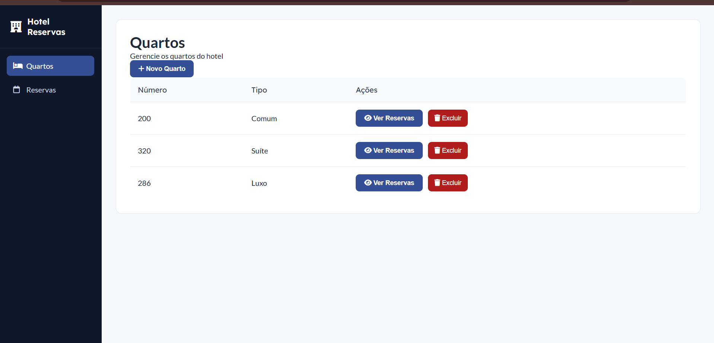
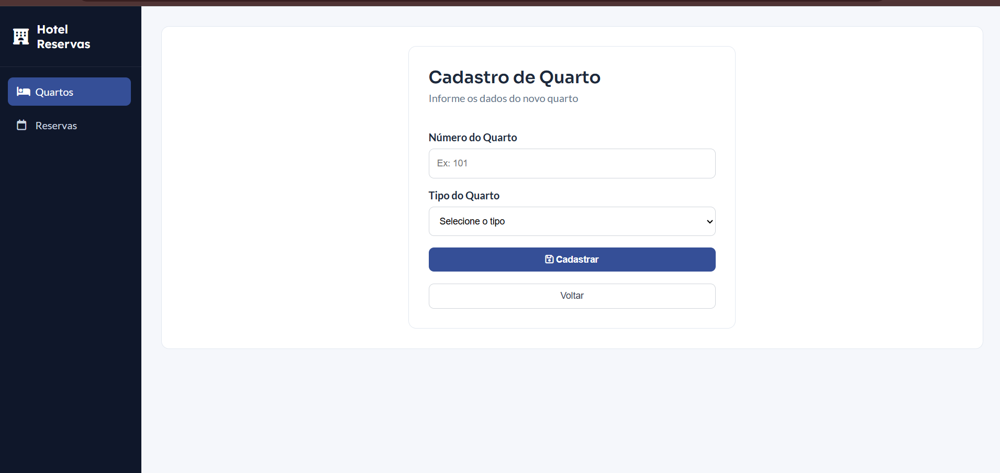
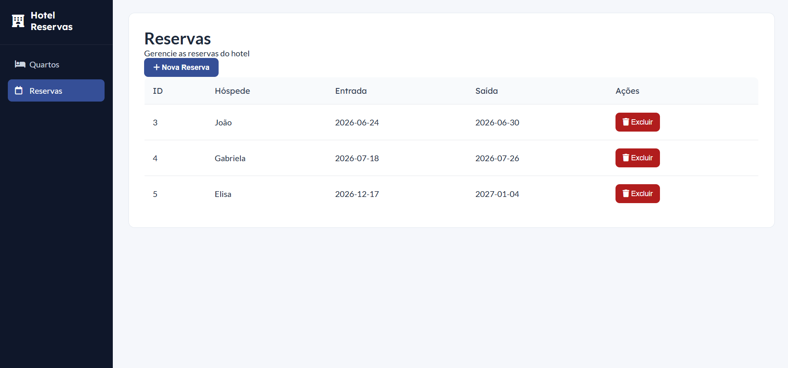

#  Hotel Reservas

Sistema web desenvolvido para gerenciamento de quartos e reservas de um hotel, permitindo o cadastro e exclusão de quartos e reservas através da integração entre frontend, backend e banco de dados.

## Funcionalidades

### Quartos
- Cadastrar quartos
- Visualizar quartos cadastrados
- Excluir quartos

### Reservas
- Cadastrar reservas associadas a um quarto
- Visualizar reservas cadastradas
- Excluir reservas

## Tecnologias utilizadas

- HTML
- CSS
- JavaScript
- Node.js
- Express.js
- MySQL

## Infraestrutura

- **IDE:** Visual Studio Code
- **SGBD:** MySQL
- **Servidor de aplicação:** Node.js com Express
- **Navegador utilizado:** Google Chrome

## Como executar

1. Clone o repositório
2. Importe o banco de dados localizado na pasta `docs`
3. Execute o backend na pasta `api` utilizando:
bash
npm install
npm start

### Tela Quartos Listados

### Cadastro de Quarto

### Tela Reservas Listadas

### Cadastro de Reserva

